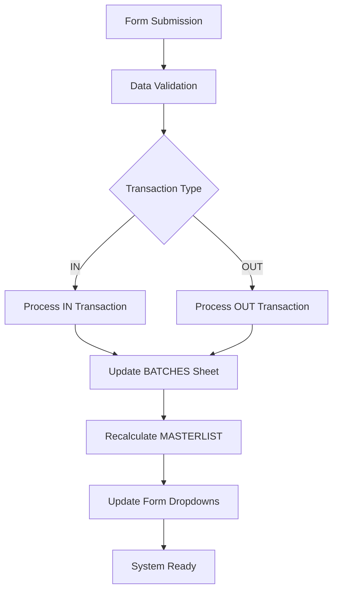

# Chemical Inventory Management System - Project Structure

## 📁 Project Overview

This repository contains a complete Chemical Inventory Management System built on Google Sheets, Google Forms, and Google Apps Script. The system provides automated tracking of chemical inventory with real-time calculations and dynamic form updates.

## 📂 File Structure

```
chem_inventory_sys/
├── 📄 README.md                    # Complete setup and usage guide
├── 📄 QUICK_START.md               # 5-minute setup guide
├── 📄 PROJECT_STRUCTURE.md         # This file
├── 📄 sys_reqs.txt                 # Original system requirements
├── 📄 chem_inv_data.csv            # Initial chemical and supplier data
├── 🖼️ inv_sys.jpeg                # System ER diagram
└── 📁 scripts/                     # Google Apps Script files
    ├── 📄 Code.gs                  # Main processing logic (form submissions, updates)
    ├── 📄 SheetInitializer.gs      # Sheet creation and initial data setup
    ├── 📄 FormManager.gs           # Google Form creation and management
    ├── 📄 DataProcessingUtils.gs   # Utilities and validation functions
    ├── 📄 TestSuite.gs             # Comprehensive testing framework
    └── 📄 DeploymentUtils.gs       # Deployment and maintenance tools
```

## 🧩 Component Description

### Core Scripts (`scripts/`)

#### 1. **Code.gs** - Main System Engine

- **Purpose**: Primary form submission processing and data updates
- **Key Functions**:
  - `onFormSubmit()` - Processes form submissions
  - `updateMasterlist()` - Recalculates inventory totals
  - `updateFormDropdowns()` - Updates form dropdown options
  - `setupTriggers()` - Configures automatic triggers

#### 2. **SheetInitializer.gs** - System Setup

- **Purpose**: Creates and initializes all required Google Sheets
- **Key Functions**:
  - `initializeAllSheets()` - One-click sheet setup
  - Individual sheet creators for each data table
  - `verifySheetStructure()` - Validates setup completeness

#### 3. **FormManager.gs** - Form Management

- **Purpose**: Creates and manages Google Form structure
- **Key Functions**:
  - `createChemicalInventoryForm()` - Builds complete form
  - `updateAllFormDropdowns()` - Refreshes dropdown data
  - `setupFormLogic()` - Configures conditional sections

#### 4. **DataProcessingUtils.gs** - Business Logic

- **Purpose**: Utilities for validation, calculations, and processing
- **Key Classes**:
  - `DataValidator` - Input validation and error checking
  - `BatchProcessor` - Batch number management and updates
  - `CalculationUtils` - Inventory calculations and formulas
  - `SystemHealth` - Health monitoring and diagnostics

#### 5. **TestSuite.gs** - Quality Assurance

- **Purpose**: Comprehensive testing framework
- **Key Functions**:
  - `runAllTests()` - Complete system validation
  - Performance testing and load testing
  - Integration testing end-to-end workflows

#### 6. **DeploymentUtils.gs** - System Operations

- **Purpose**: Deployment automation and system maintenance
- **Key Functions**:
  - `deployChemicalInventorySystem()` - One-click deployment
  - `SystemMonitor` - Real-time system monitoring
  - `SystemMaintenance` - Automated maintenance tasks

### Documentation Files

#### **README.md** - Complete Documentation

- Comprehensive setup instructions
- Detailed system architecture
- Usage guide with examples
- Troubleshooting and maintenance guides
- Security considerations

#### **QUICK_START.md** - Express Setup

- 5-minute deployment guide
- Essential configuration steps
- Common issues and quick fixes
- Status verification checklist

#### **sys_reqs.txt** - Original Requirements

- Complete system specifications
- Data flow documentation
- Business rules and logic
- Sheet structure definitions

## 🗄️ Data Architecture

### Google Sheets Structure

```
Spreadsheet: "Chem Inventory"
├── 📋 Form Responses         # Raw form submission data
├── 👥 STAFF_LIST            # Lab staff/chemist master data
├── 🧪 CHEM_LIST             # Chemical master data with properties
├── 🏭 SUPPLIER_BRANDS       # Supplier and brand combinations
├── 📍 LOC_LIST              # Storage location master data
├── 📦 BATCHES               # Individual batch tracking with volumes
├── 📊 MASTERLIST            # Aggregated inventory levels and alerts
├── ⚙️ SYSTEM_CONFIG         # System configuration and metadata
└── 📈 SYSTEM_METRICS        # Performance and health metrics
```

### Google Form Structure

```
Form: "Chemical Inventory Transaction Form"
├── Section 1: Basic Info
│   ├── Transaction Date
│   ├── Staff Name (dropdown)
│   ├── Chemical Name (dropdown)
│   └── Transaction Type (IN/OUT with conditional logic)
├── Section 2: IN Transaction (conditional)
│   ├── Supplier (dropdown)
│   ├── Brand (dropdown)
│   ├── Batch/Lot Number
│   ├── Number of Bottles
│   ├── Volume/Weight per Bottle
│   ├── Expiration Date
│   └── Storage Location (dropdown)
└── Section 3: OUT Transaction (conditional)
    ├── Out Type (prep/transfer)
    ├── Select Batch (dynamic dropdown)
    ├── Total Volume/Weight Out
    └── Optional Comment
```

## 🔄 System Workflow

### Data Flow Process



### Automated Triggers

1. **Form Submission Trigger**: Processes new transactions immediately
2. **Timed Trigger**: Updates form dropdowns every 6 hours
3. **Maintenance Trigger**: Daily system maintenance at 2 AM

## 🚀 Deployment Guide

### Quick Deployment (5 minutes)

1. **Create Google Resources**:

   ```
   ✓ New Google Spreadsheet: "Chem Inventory"
   ✓ New Google Form: "Chemical Inventory Transaction Form"
   ✓ Note the IDs from URLs
   ```

2. **Deploy Scripts**:

   ```javascript
   // In Google Apps Script, create 6 files from scripts/ folder
   // Update IDs in all files
   // Run: deployChemicalInventorySystem()
   ```

3. **Verify Deployment**:
   ```javascript
   // Run: runAllTests()
   // Verify: All tests pass
   ```

### System Requirements

- **Google Account** with Sheets, Forms, and Apps Script access
- **Permissions**: Editor access to create sheets and forms
- **Time**: 5-10 minutes for complete setup

## 🧪 Testing Framework

### Test Coverage

| Test Suite                 | Coverage           | Purpose                              |
| -------------------------- | ------------------ | ------------------------------------ |
| **Basic System**           | Core functionality | Verify essential components work     |
| **Sheet Structure**        | Data integrity     | Validate sheet setup and data        |
| **Form Functionality**     | User interface     | Test form structure and dropdowns    |
| **Transaction Processing** | Business logic     | Validate IN/OUT transaction handling |
| **Data Validation**        | Input verification | Test validation rules and errors     |
| **Calculation Accuracy**   | Mathematical logic | Verify inventory calculations        |
| **Error Handling**         | Fault tolerance    | Test system resilience               |

### Running Tests

```javascript
// Complete test suite
runAllTests();

// Performance testing
runPerformanceTests();

// Load testing
runLoadTest(50); // 50 concurrent transactions

// Integration testing
runIntegrationTest();
```

## 📊 Monitoring & Maintenance

### System Health Monitoring

```javascript
// Check system status
SystemMonitor.getSystemStatus();

// View system metrics
getDeploymentInfo();

// Perform health check
SystemHealth.performHealthCheck(SPREADSHEET_ID);
```

### Automated Maintenance

- **Daily**: Form dropdown updates, masterlist recalculation
- **Every 6 Hours**: Trigger-based updates and data sync
- **Weekly**: System health reports and data integrity checks
- **Monthly**: Performance optimization and cleanup

### Manual Maintenance

```javascript
// Routine maintenance
SystemMaintenance.performRoutineMaintenance();

// Update all dropdowns
updateAllFormDropdowns();

// Recalculate all totals
updateMasterlist();

// Reset system configuration
setupSystemConfiguration();
```

## 🔒 Security & Access Control

### Access Levels

| Role               | Spreadsheet | Form       | Apps Script |
| ------------------ | ----------- | ---------- | ----------- |
| **System Admin**   | Editor      | Editor     | Owner       |
| **Lab Supervisor** | Editor      | Viewer     | Viewer      |
| **Lab Staff**      | Viewer      | Respondent | No Access   |

### Best Practices

- ✅ Regular access audits
- ✅ Two-factor authentication enabled
- ✅ Sharing links disabled when not needed
- ✅ Regular permission reviews
- ✅ Audit trail maintenance

## 📈 Performance Optimization

### System Limits

- **Form Responses**: Unlimited (Google Sheets limit: 2M cells)
- **Batch Records**: ~10,000 recommended for optimal performance
- **Concurrent Users**: 50-100 users supported
- **Update Frequency**: Real-time processing with 6-hour batch updates

### Optimization Tips

1. **Regular Data Archiving**: Archive old transactions to maintain performance
2. **Index Optimization**: Keep lookup tables (CHEM_LIST, etc.) small and organized
3. **Trigger Management**: Monitor and optimize trigger execution times
4. **Cache Management**: Use Apps Script caching for frequently accessed data

## 🆘 Support & Troubleshooting

### Common Issues

| Issue                          | Solution                       |
| ------------------------------ | ------------------------------ |
| Form not submitting            | Run `setupTriggers()`          |
| Dropdowns showing "Loading..." | Run `updateAllFormDropdowns()` |
| Calculations incorrect         | Run `updateMasterlist()`       |
| System health warnings         | Check logs and run diagnostics |

### Getting Help

1. **First**: Check [README.md](README.md) troubleshooting section
2. **Second**: Run system diagnostics
3. **Third**: Review Apps Script execution logs
4. **Last**: Contact system administrator

## 📝 Version History

- **v1.0.0** (2024-12-15): Initial release with complete functionality

## 🔮 Future Enhancements

### Planned Features

- [ ] Advanced reporting dashboard
- [ ] Automated reorder alerts
- [ ] Mobile-optimized form interface
- [ ] Data export/import utilities
- [ ] Integration with laboratory management systems

### Enhancement Requests

Submit feature requests through system feedback channels or direct contact with development team.

---

_This project structure documentation is maintained alongside the Chemical Inventory Management System. Last updated: December 2024_
